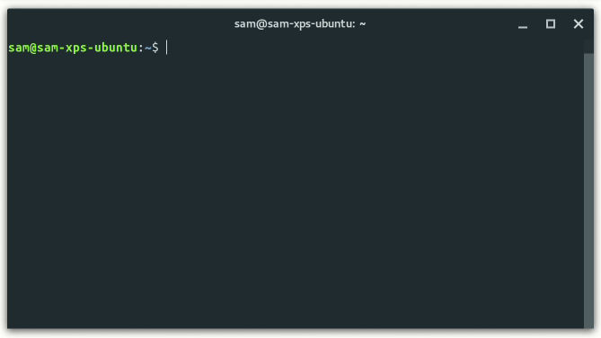

# g

Simple go version manager, gluten-free.

[](./LICENSE)

<div align="center"></div>

## Why?

Existing version managers build go from source, have too many dependencies, pollute the PATH, and/or require you to use a specific shell environment. `g` aims to be as unobtrusive and portable as possible.

`g` is inspired by [tj/n](https://github.com/tj/n) - which I have contributed to in the past - and borrows some of its code.


## Features

* Works no matter what shell you use as long as `$GOPATH` and `$GOROOT` are exported, which are not specific to `g` but idiomatic to `go`.
* No need to `source` functions in your shell config.
* Single shell script that ideally lives where your go binaries live.
* Downloads pre-built binaries so it is fast and...
* ...requires no git, no mercurial, no gcc, no xcode, etc.
* `curl` and `wget` first-class support alike.
* Colorful UI and interactive but safe to pipe and use in automated scripts.
* self-upgrade command to keep up-to-date
* Get started with a single line.


## Requirements

* macOS, Linux or BSD environment. [Bash for Windows (WSL)](https://docs.microsoft.com/en-us/windows/wsl/about) is supported as well.
* Either [`curl`](https://en.wikipedia.org/wiki/CURL) or [`wget`](https://en.wikipedia.org/wiki/Wget), check with `curl -V` or `wget -V` respectively.

Not strictly necessary, but highly recommended, to completely remove any previous go installation — just to prevent any weird outcome.


## Single-line Installation

**IMPORTANT**: Before you continue, I encourage you to [read the install script](https://git.io/g-install); never trust someone telling you to run random commands.

That said, you can install `g` with a single command:

```shell
curl -sSL https://git.io/g-install | sh -s
```

If you use `wget` instead:

```shell
wget -qO- https://git.io/g-install | sh -s
```

That will download the [`g` script](./bin/g), put it inside `$GOPATH/bin/`, give it execution rights with `chmod`, and configure your default shell's initialization file, setting the `GOPATH` & `GOROOT` environment variables and adding `$GOPATH/bin` to the `PATH`.

Then you will prompted to install the latest version of go; you can skip this step and install your preferred version with `g` later.

**NOTE**: You must restart your current shell session for it to read these new env vars in order to use `g` or `go`.

### Shell support

The install script currently supports the following shells:

* bash
* zsh
* fish
* ash
* dash
* csh
* tcsh

That doesn't mean you cannot use `g` with other shells like `tcsh`, just proceed with the [manual installation](#manual-installation).

The install script is going to select your default shell for configuration. You might see what your default shell is by running:

```shell
echo $SHELL
```

If you wish to configure a diff shell, you might pass it as arguments:

```shell
curl -sSL https://git.io/g-install | sh -s -- fish
```

You might as well configure several shells, but that's usually not required:

```
curl -sSL https://git.io/g-install | sh -s -- fish bash zsh
```

### Changing defaults

By default, these go environment variables are used:

```
GOROOT: $HOME/.go
GOPATH: $HOME/go
```

`$GOPATH/bin` is added to the `PATH` and there's where `g` is copied to.

You might set those variables before running the install script. For example, in bash and zsh:

```shell
export GOROOT=~/.local/share/golang
export GOPATH=~/MyProjects/go-projects
curl -sSL https://git.io/g-install | sh -s
```

In fish:

```shell
set -gx GOROOT ~/.local/share/golang
set -gx GOPATH ~/MyProjects/go-projects
curl -sSL https://git.io/g-install | sh -s
```

## Manual Installation

1. Make sure to export the `$GOPATH` & `$GOROOT` environment variables and add `$GOPATH/bin` to your `PATH`.
2. Grab a copy of the [`./bin/g`](./bin/g) script and put it anywhere available in your `PATH` — inside `$GOPATH/bin/` is a good option.
3. Give the script execution rights with `chmod +x $GOPATH/bin/g`.
4. Restart your shell session to make sure the env variables are loaded.


## Upgrading

`g` includes a `self-upgrade` command you can run to get the latest version of `g`. This command simply runs the install script once again.


## Usage

```
  Usage: g [COMMAND] [options] [args]

  Commands:

    g                           Open interactive UI with installed versions
    g install <version>         Install go <version>
    g install latest            Install or activate the latest go release
    g install -a 386 latest     Force 32 bit architecture
    g install -o darwin latest  Override operating system
    g run <version>             Run a given version of go
    g which <version>           Output bin path for <version>
    g remove <version ...>      Remove the given version(s)
    g prune                     Remove all versions except the current version
    g list                      Output installed go versions
    g list-all                  Output all available go versions
    g self-upgrade              Upgrades g to the latest version
    g help                      Display help information, same as g --help

  Options:

    -h, --help              Display help information and exit
    -v, --version           Output current version of g and exit
    -q, --quiet             Disable curl output (if available)
    -d, --download          Download only
    -c, --no-color          Force disabled color output
    -y, --non-interactive   Prevent prompts
    -o, --os                Override operating system
    -a, --arch              Override system architecture
    -u, --unstable          Include unstable versions in list
```

## Uninstall

`g` is a single portable shell script that acts like a binary that's available in your `$PATH`. If you setup `g` with the install script, its removal should be pretty straight forward.

First of all, get some info about your system:

```shell
echo $SHELL
echo $GOROOT
echo $GOPATH
command -v g
```

You will notice the `g` file lives inside your `$GOPATH/bin/` directory. If you only want to remove `g` and keep your currently installed `go` binaries and related files, simply delete `g`:

```shell
# If you're using bash, zsh, or other POSIX shell:
rm "$(command -v g)"

# If you're using fish:
rm (command -v g)
```

Now, if you want to remove everything, first **be sure to backup** your projects inside `$GOROOT`, if any. Then remove everything inside `$GOROOT` and `$GOPATH`:

```shell
rm -r $GOPATH $GOROOT
```

Then open your shell config file with your text editor of choice and look of for a line that includes `g-install` to remove it. These are the locations usually used by the install script:

```shell
# bash on MacOS
~/.bash_profile

# bash on linux/BSD
~/.bashrc

# zsh
~/.zshrc

# fish shell
~/.config/fish/config.fish

# csh
~/.cshrc

# tcsh
~/.tcshrc

# For ash for dash, check your $ENV var
echo $ENV
```

At this point you would have removed `g` and `go` entirely.


## TODO

- [ ] Improve docs a bit more
- [x] Make `g` and `g-install` POSIX compliant
- [x] Add support for more shells
- [ ] Warn users they already have a golang installation when using `g-install`
- [ ] Use better naming for `g install <version>`, maybe `use` or `set`. See #8
    - [ ] Use `install` only for install and remove the `--download` option
- [ ] Handle the case when `g` already exists, mainly `zsh` with `oh-my-zsh`
    - [ ] Make it so `g-install` offers the user to setup an alternative alias for `g`
- [ ] Make the `self-upgrade` command throw if `g` was not installed in the common way
- [ ] Add a `complete` command that generates completions for the supported shells
    - [ ] And have `g-install` setup the shells to call this command for completions
- [ ] Explore feature to configure shells to autoload go versions based on a project file
- [ ] Test it on diff platforms
- [ ] Crete a test setup with docker and Github actions


## The alternatives (and why I prefer `g`)

* [moovweb/gvm](https://github.com/moovweb/gvm)
    - Too many features.
    - Builds from source, i.e, requires gcc, make, xcode, etc.
    - Requires git and mercurial.
    - Requires bootstrapping, i.e., install go 1.4 first.
    - Specific to a shell, i.e., doesn't work with fishshell.
* [syndbg/goenv](https://github.com/syndbg/goenv)
    - Too many features and weird DX.
    - Uses an hard-coded list of go versions...
    - ...thus you have to upgrade `goenv` before installing a new version of go.
    - Adds a lot to your env and PATH.
* [hit9/oo](https://github.com/hit9/oo)
    - Pretty much same as `gvm`.
* [asdf-golang](https://github.com/kennyp/asdf-golang)
    - Depends on [asdf](https://github.com/asdf-vm/asdf).
* [andrewkroh/gvm](https://github.com/andrewkroh/gvm)
    - Bash, batch and powershell support only.
    - Cumbersome to use.
* [MakeNowJust/govm](https://github.com/MakeNowJust/govm)
    - Builds from source.
    - Requires python 2.


## Contributing

Please read [CONTRIBUTING.md](./CONTRIBUTING.md). ♥


## Acknowledgments

* [Every contributor to this project](https://github.com/stefanmaric/g/graphs/contributors).
* The [`n` project](https://github.com/tj/n), which  `g` is inspired by and based on.
* The [`n-install` project](https://github.com/mklement0/n-install), which `g` is also based on.


## License

[MIT](./LICENSE) ♥
