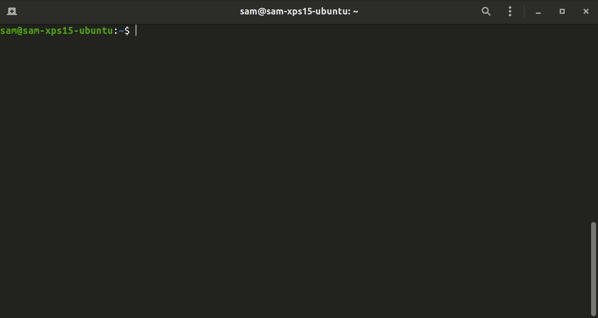

# g

Simple go version manager, gluten-free.

<div align="center"></div>

## Why?

Existing version managers often build Go from source, require a specific shell, pollute your environment with shims and functions, or bring a large plugin ecosystem you might not need.

`g` aims to be as unobtrusive and portable as possible: one readable shell script, official prebuilt Go archives, no privileged install, and just a pair of idiomatic Go env variables to get you setup.

`g` is inspired by [tj/n](https://github.com/tj/n) - which I have contributed to in the past - and borrows some of its code.

## Features

- Get started with Go with a single line using the install script.
- Quickly install new versions using official prebuilt Go archives.
- Run any go version on demand without changing the active one.
- Colorful and interactive TUI but safe to pipe and use in automated scripts.
- Trusted: install and use Go versions as an unprivileged user; no `sudo`.
- Discover new Go versions including unstable beta and RC releases.
- Faster downloads by picking a mirror closer to you.
- A single, portable POSIX script that works across all common shells without shims.
- Transparent: `g` is a shell script you can inspect, copy, and patch.

## Requirements

- macOS, Linux, BSD, or WSL.
- A POSIX-compatible shell.
- Either `curl` or `wget`.
- `sha256sum`, `shasum`, or `openssl`.

You most likely have them all already.

## Installation

Before running any script, read it first: [`https://git.io/g-install`](https://git.io/g-install)

Then install with `curl`:

```shell
curl -fsSL https://git.io/g-install | sh
```

Or with `wget`:

```shell
wget -qO- https://git.io/g-install | sh
```

`g` uses the standard Go environment variables. The installer defaults to:

```shell
GOROOT=$HOME/.go
GOPATH=$HOME/go
```

`$GOPATH/bin` must be on `PATH` because that is where `g` and the active `go` binary live.

The installer downloads `g` to `$GOPATH/bin/g`, makes it executable, and updates your shell startup file with `GOROOT`, `GOPATH`, and `$GOPATH/bin` in `PATH`.

Restart your shell after installation so the new environment is loaded.

### Installer Options

Skip all prompts and assume "yes", will install the lastest Go version right away:

```shell
curl -fsSL https://git.io/g-install | sh -s -- -y
```

Configure a specific shell:

```shell
curl -fsSL https://git.io/g-install | sh -s -- zsh
```

Configure more than one shell:

```shell
curl -fsSL https://git.io/g-install | sh -s -- fish bash zsh
```

The installer supports `bash`, `zsh`, `fish`, `ash`, `dash`, `csh`, and `tcsh`.

If `g` is already used as a shell alias, the installer can configure an alternative alias.

To choose different defaults, set `GOROOT` and `GOPATH` before installing:

```shell
export GOROOT=$HOME/.local/share/golang
export GOPATH=$HOME/go-projects
curl -fsSL https://git.io/g-install | sh
```

For `fish`:

```shell
set -gx GOROOT $HOME/.local/share/golang
set -gx GOPATH $HOME/go-projects
curl -fsSL https://git.io/g-install | sh
```

## Manual Installation

1. Configure the relevant variables in your shell initialization script
   - Set `GOROOT` and `GOPATH`.
   - Add `$GOPATH/bin` to `PATH`.
2. Copy [`bin/g`](./bin/g) to `$GOPATH/bin/g` or another directory on your `PATH`.
3. Make it executable: `chmod +x "$GOPATH/bin/g"`

## Usage

### The Basics

Install the latest stable Go release and make it active:

```shell
g install latest
```

Install and use a specific version:

```shell
g install 1.22.2
```

List what you have installed already:

```shell
g list
```

List available Go versions:

```shell
g list-all
```

Run a specific version without changing the active one:

```shell
g run 1.22.2 version
```

Remove an old version:

```shell
g remove 1.21.9
```

Run `g` with no command to open the interactive picker for installed versions.

### Command Reference

```text
Usage: g [COMMAND] [options] [args]

Commands:
  g                         Open interactive UI with downloaded versions
  g install latest          Download and set the latest Go release
  g install <version>       Download and set Go <version>
  g download <version>      Download Go <version>
  g set <version>           Switch to Go <version>
  g run <version>           Run a given version of Go
  g which <version>         Output bin path for <version>
  g remove <version ...>    Remove the given version(s)
  g prune                   Remove all versions except the current version
  g list                    Output downloaded Go versions
  g list-all                Output all available remote Go versions
  g self-upgrade            Upgrade g to the latest version
  g help                    Display help information, same as g --help

Options:
  -h, --help                Display help information and exit
  -v, --version             Output current version of g and exit
  -q, --quiet               Suppress almost all output
  -c, --no-color            Force disabled color output
  -y, --non-interactive     Prevent prompts
  -o, --os                  Override operating system
  -a, --arch                Override system architecture
  -u, --unstable            Include unstable versions in list
  --archive-url             Override Go archive base URL

Aliases:
  g install                 use
  g download                fetch
  g run                     exec
  g remove                  rm, uninstall
  g list                    ls
  g list-all                ls-remote, list-remote
  g self-upgrade            self-update
```

### Platform Overrides

By default, `g` detects your operating system and architecture from the current machine. Use `--os` and `--arch` to override that target:

```shell
g install 1.22.2 --os linux --arch amd64
```

This is useful when you need a different Go build, for example an `amd64` Go on Apple Silicon. If the same version is already installed and you install it again with a different explicit architecture, `g` replaces it.

### Mirrors

By default, archives are downloaded from [`https://dl.google.com/go`](https://dl.google.com/go).

Use `--archive-url` to download archives from a mirror:

```shell
g install latest --archive-url https://golang.google.cn/dl
```

Or set a default with `G_GO_ARCHIVE_URL`:

```shell
export G_GO_ARCHIVE_URL=https://golang.google.cn/dl
g install latest
```

Archive-only mirrors also work as long as they serve official Go archive filenames:

```shell
export G_GO_ARCHIVE_URL=https://mirrors.aliyun.com/golang
g install 1.22.2
```

Mirror downloads are still verified against the official Go checksum before extraction.

## Upgrading

If `g` was installed with the installer, upgrade it with:

```shell
g self-upgrade
```

## Uninstall

To remove only `g`, delete the executable:

```shell
# If you're using bash, zsh, or other POSIX shell:
rm "$(command -v g)"

# If you're using fish:
rm (command -v g)
```

To remove Go versions installed by `g`, remove `$GOROOT` after backing up anything important:

```shell
rm -r "$GOROOT"
```

If you used the installer, also delete the `g-install` line from your shell startup file. Common locations are:

```text
~/.bash_profile              bash on macOS
~/.bashrc                    bash on Linux/BSD
~/.zshrc                     zsh
~/.config/fish/config.fish   fish
~/.cshrc                     csh
~/.tcshrc                    tcsh
$ENV                         ash or dash
```

## Alternatives

`g` is intentionally small: one POSIX shell script, official prebuilt archives, checksum verification, and minimal shell setup. Other tools may be a better fit if you want project-local version files, a plugin ecosystem, Windows-first support, or source builds.

| Project                                                             | Good fit when                                                              | Tradeoff compared with `g`                                              |
| ------------------------------------------------------------------- | -------------------------------------------------------------------------- | ----------------------------------------------------------------------- |
| [moovweb/gvm](https://github.com/moovweb/gvm)                       | You want a full-featured Go environment manager.                           | Builds Go from source and has more moving parts.                        |
| [syndbg/goenv](https://github.com/syndbg/goenv)                     | You like the `rbenv`/`pyenv` style.                                        | Uses shims and a heavier shell integration model.                       |
| [hit9/oo](https://github.com/hit9/oo)                               | You want a source-based Go manager with a small interface.                 | Builds from source instead of using official archives.                  |
| [asdf-golang](https://github.com/kennyp/asdf-golang)                | You already use [`asdf`](https://github.com/asdf-vm/asdf).                 | Requires the `asdf` plugin system.                                      |
| [andrewkroh/gvm](https://github.com/andrewkroh/gvm)                 | You want Bash, Batch, and PowerShell workflows.                            | Less shell-agnostic and uses a different workflow.                      |
| [MakeNowJust/govm](https://github.com/MakeNowJust/govm)             | You want a minimal manager and do not mind source builds.                  | Builds from source and has extra runtime requirements.                  |
| [kevincobain2000/gobrew](https://github.com/kevincobain2000/gobrew) | You want a Go-written manager with Windows support and extra conveniences. | Larger tool with its own root layout and shell setup.                   |
| [`golang.org/dl`](https://pkg.go.dev/golang.org/dl)                 | You want the official wrapper commands for specific Go versions.           | Installs one wrapper per version and does not manage switching for you. |

Use `g` if you want something that stays close to how Go itself is distributed:
download official archives, verify them, and switch versions without much fuss.

## Contributing

Please read [CONTRIBUTING.md](./CONTRIBUTING.md). ♥

## Acknowledgments

- [Every contributor to this project](https://github.com/stefanmaric/g/graphs/contributors).
- The [`n` project](https://github.com/tj/n), which `g` is inspired by and based on.
- The [`n-install` project](https://github.com/mklement0/n-install), which `g` is also based on.

## License

[MIT](./LICENSE) ♥
